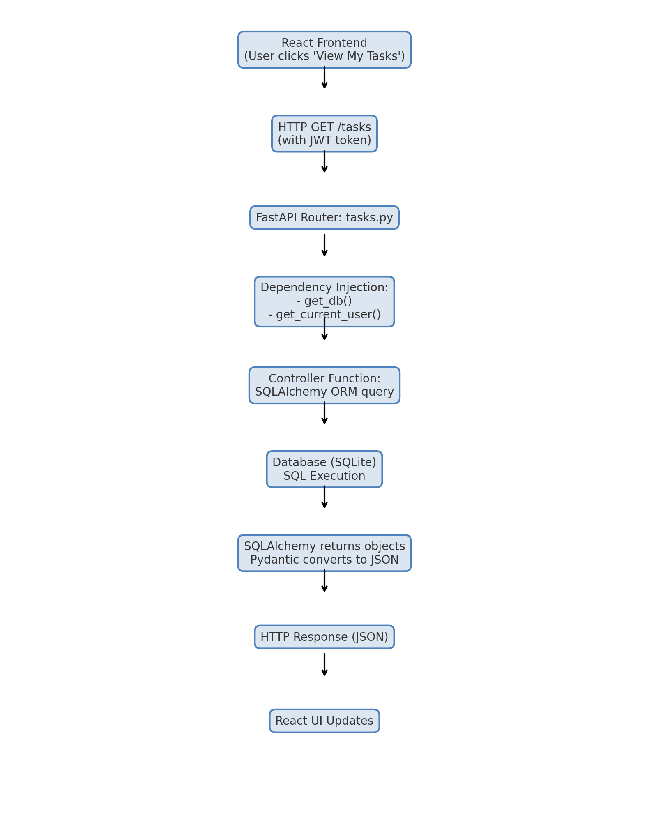

# Task Management System(TMS) Backend

## Architecture Flow Diagram

Below is the flow of a typical request from the frontend to the backend and back.

---
**Steps:**
1. User clicks "View My Tasks" in the React frontend.
2. Browser sends HTTP GET `/tasks` with JWT token in the Authorization header.
3. FastAPI router (`tasks.py`) handles the request.
4. Dependency injection provides DB session & validates JWT.
5. SQLAlchemy queries SQLite for tasks belonging to the logged-in user.
6. Results are converted to JSON via Pydantic.
7. Response is sent back to the frontend.
8. React updates the UI with the retrieved tasks. 
